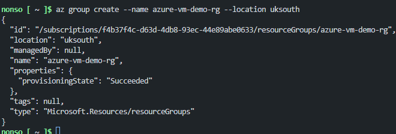
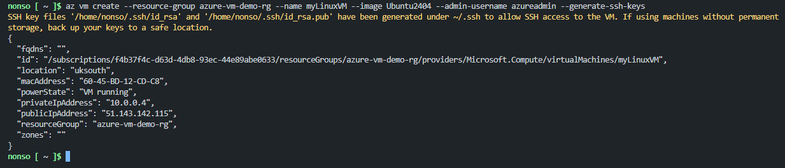
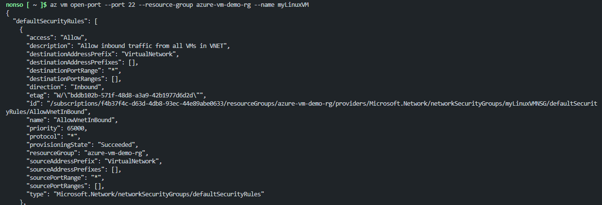
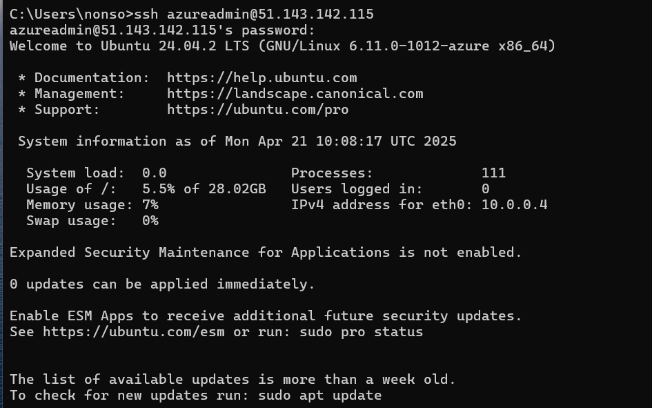
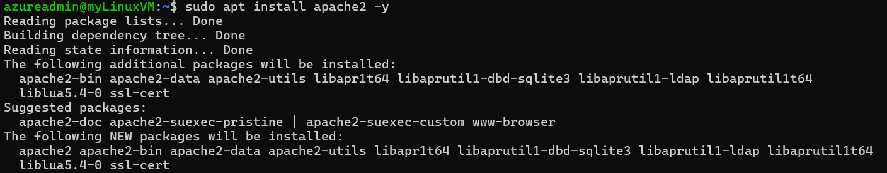
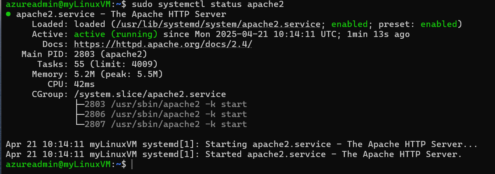
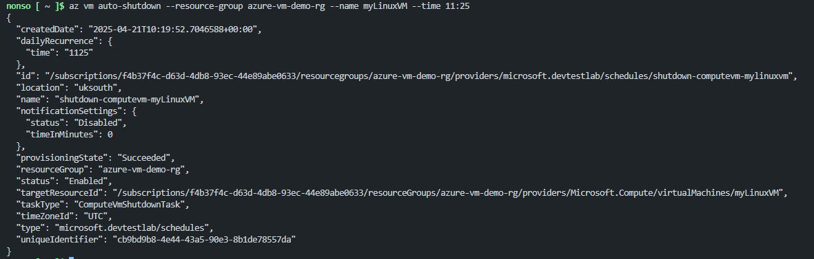
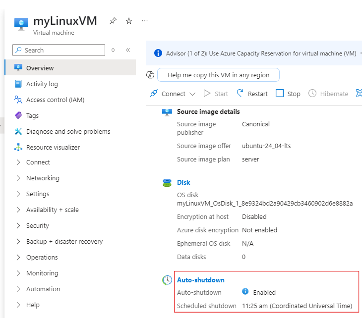

# Project 01 - Deploy a Virtual Machine (VM) in Azure

## 🧠 Overview

In this project, I deployed a Linux Virtual Machine (VM) on Microsoft Azure using the Azure CLI. The project demonstrates foundational skills in setting up compute resources, networking, and remote access in the cloud.

---

## ✅ Skills Covered

- Azure Virtual Machines
- Azure Resource Groups
- Virtual Networks & Network Security Groups (NSG)
- SSH & Remote Connections
- Auto-Shutdown for Cost Optimization

---

## 🛠️ Tools Used

- Azure CLI
- Azure Cloud Shell (optional alternative)
- SSH
- Ubuntu 24.04 LTS Image

---

### Create a Resource Group

---

### Deploy a Linux Virtual Machine

---

### Open Port 22 for SSH

---

### Connect to the VM

---

### Install Software (Apache)

#### Update packages

#### Install Apache

#### Check if it's running

---

### Setup Automatic Shutdown

---
