# Project 03 - Deploying a Virtual Machine Using Infrastructure as Code (IaC) on Azure

This project demonstrates how to deploy an Azure Virtual Machine using three different Infrastructure as Code (IaC) approaches:

* ARM Template

* Bicep

* Terraform

Each method deploys resources into an existing Azure Resource Group and follows a clear process from authoring the template to executing the deployment.

## Create a Resource Group

Before deploying resources, a dedicated resource group was created to organize all infrastructure components:

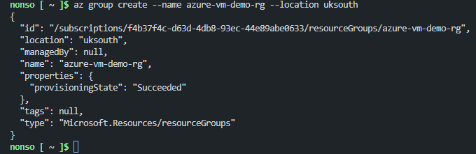

## Create ARM Template

The ARM template defines the VM, network interface, virtual network, subnet, and public IP.

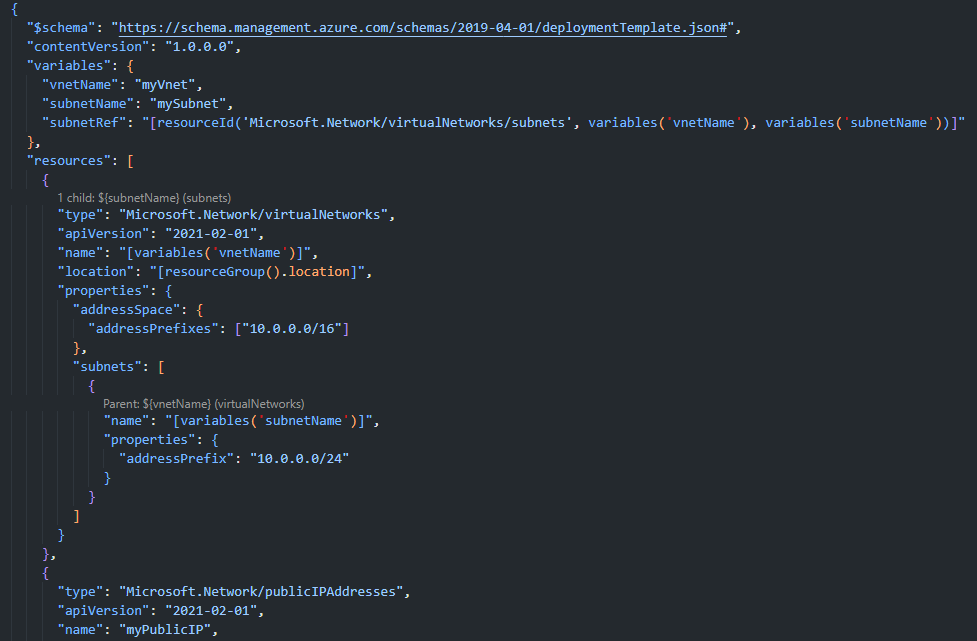

## Deploy the ARM Template

Deployed via the Azure Cloud Shell 

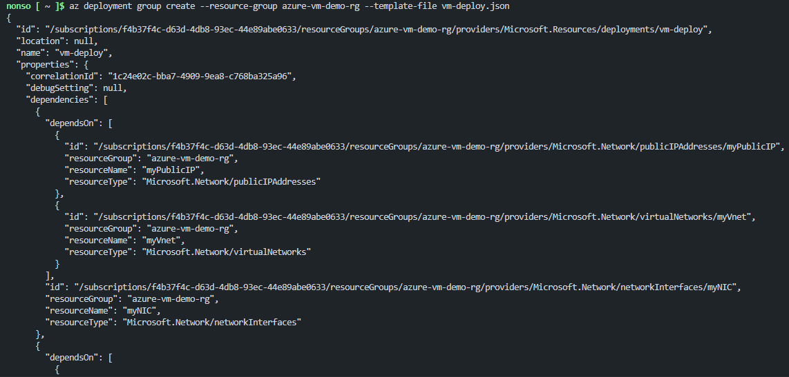

## Create Bicep File

Used Bicep syntax to simplify and improve readability of the ARM template.

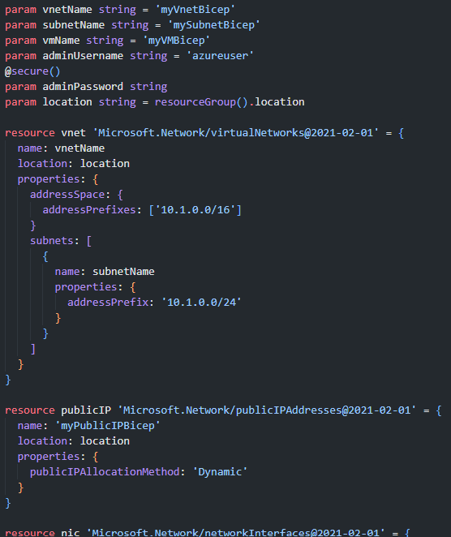

## Upload the File to Cloud Shell

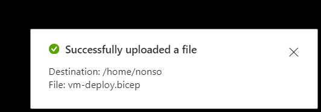

## Deploy the Bicep File

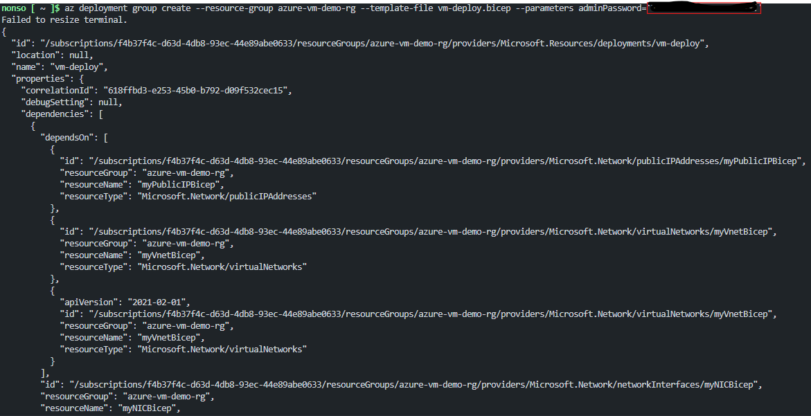

## Create a Terraform File

Terraform configuration included:

* Azure provider configuration

* Virtual network and subnet

* Public IP and NIC

* VM definition using azurerm_virtual_machine

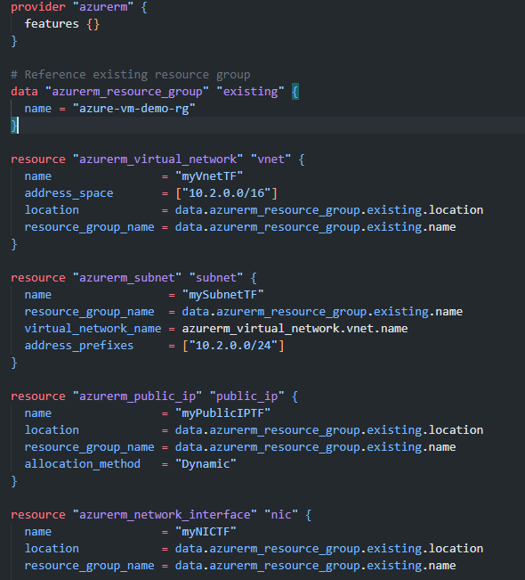

## Upload to cloud shell

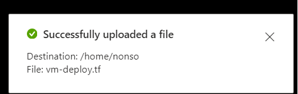

## Initialize and Deploy 

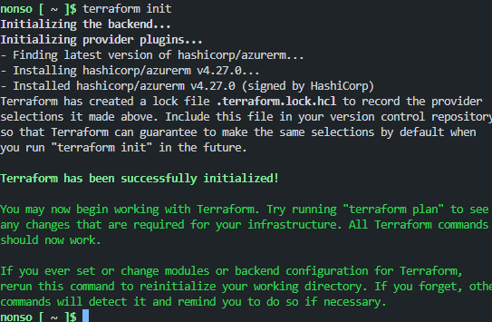

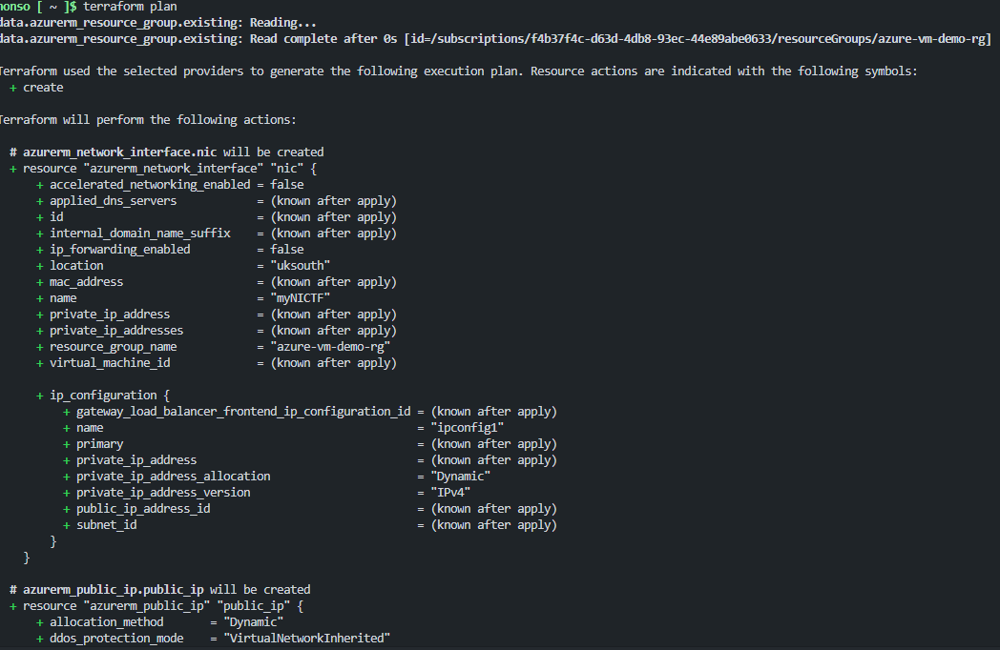

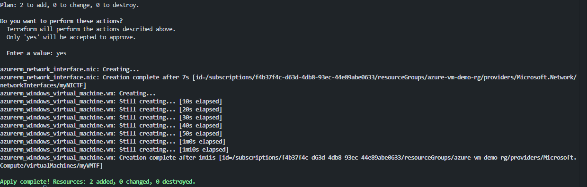

## Final Result: All VMs Successfully Deployed

All three approaches deployed Azure VMs within the same resource group, demonstrating how versatile and powerful Infrastructure as Code can be.

### VM Overview

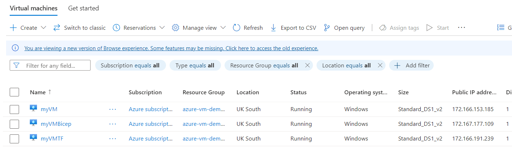

## Learnings

* Gained hands-on experience with all three IaC tools

* Learned how to debug deployment issues via Azure CLI and logs

* Practiced modular and reusable template design

* Reinforced understanding of Azure networking components