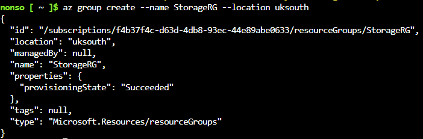
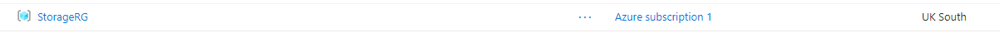
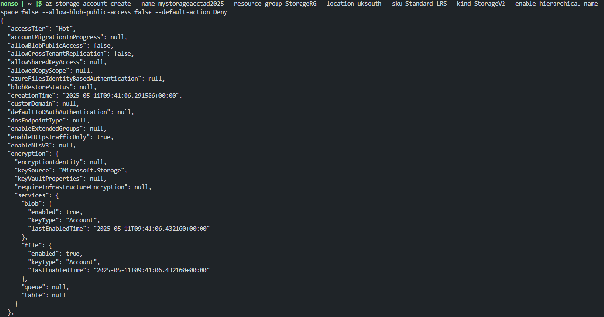
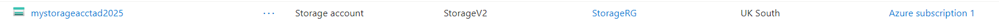
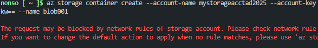
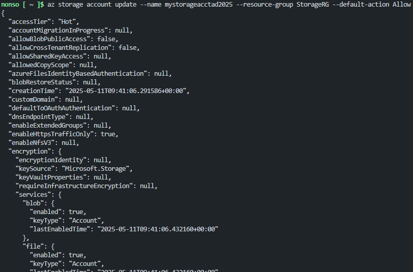
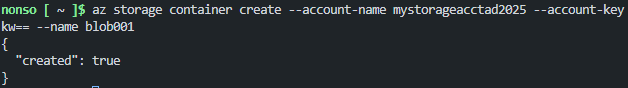
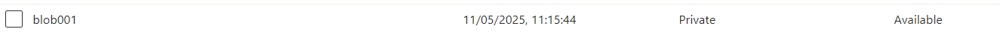
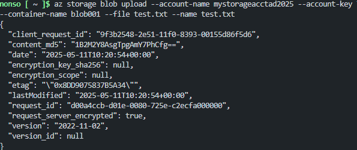
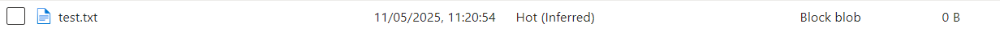

# Project 04 - Azure Storage Account Setup

This project documents the process of setting up an Azure Storage Account and Blob Container using the **Azure CLI** in **Visual Studio Code (VS Code)**. It also includes handling common network access issues and uploading a test file using the **Storage Account Key** for authentication.

## Create a Resource Group

To logically group all related resources in Azure:

## Create s Storage Account

This account will be used to store blobs, files, and other types of data. StorageV2 supports both Blob and Data Lake storage capabilities.

## Create a Blob Container

This is where you store blobs (files).

Initially, this step failed due to default network rules blocking access. Azure Storage blocks all access unless:

- "You explicitly allow your IP"

- "You allow trusted Microsoft services"

- "Or you temporarily allow all network access (used here for testing)"

## Resolve Network Access Issue

To quickly resolve access for CLI testing, I temporarily allowed access from all networks:

⚠️ Not recommended for production. Always prefer adding specific IPs.

## Test Upload

Uploaded a local file (test.txt) to verify that the blob container was correctly set up.

