# Project 05 - Azure Virtual Network Setup
This project demonstrates how to set up a secure, multi-tier virtual network in Microsoft Azure using the Azure CLI. It includes the creation of a virtual network, subnets and network security groups (NSGs).

## Create a Resource Group
We begin by creating a resource group to logically group all our networking resources.

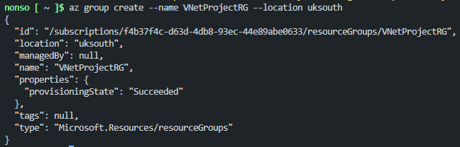

## Create Virtual Network
A virtual network (VNet) is the foundation of our Azure network architecture. Here, we define the address space that our subnets will use.

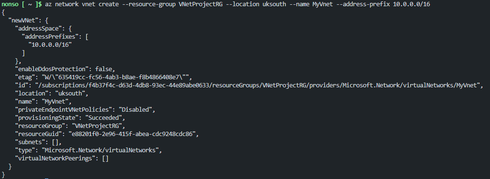

## Create Subnets
Next, we divide our VNet into three subnets:

- WebSubnet for public-facing services

- AppSubnet for internal applications

- DBSubnet for backend databases

Each subnet is assigned a unique IP address range.

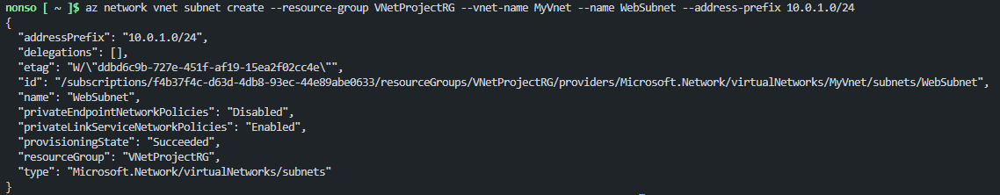

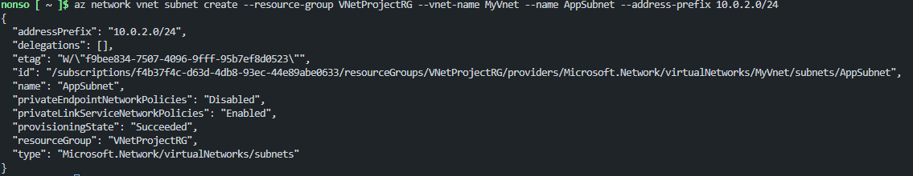

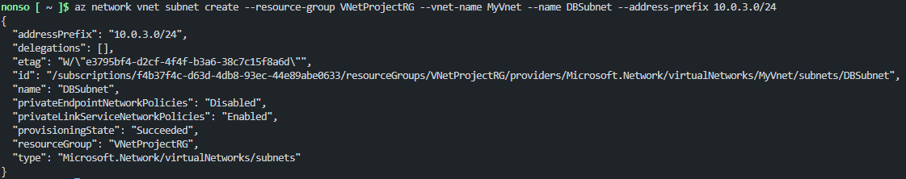

## Create NSGs and Configure Security Rules

### NSG for WebSubnet (Allow HTTP, HTTPS, SSH).

This NSG allows:

- HTTP (port 80)

- HTTPS (port 443)

- SSH (port 22 – restricted to my IP)

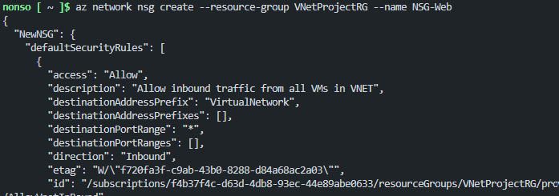

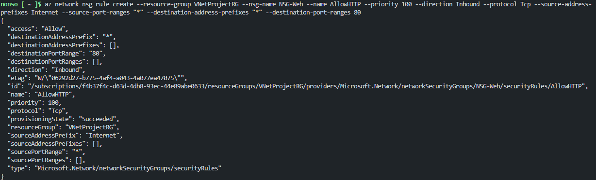

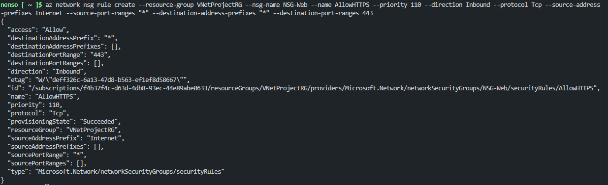

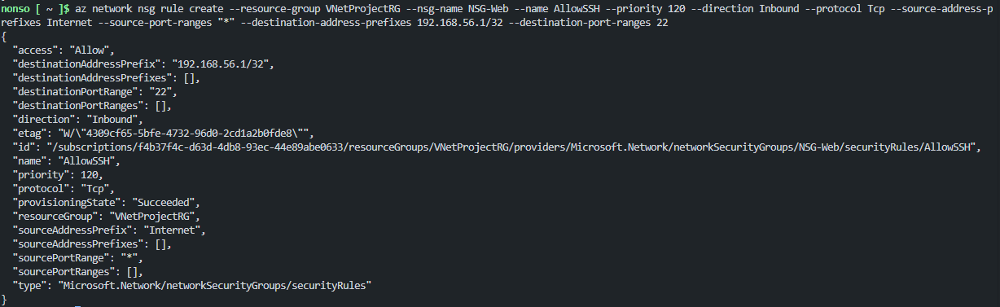

### NSG for AppSubnet (Allow from WebSubnet only)
Allows only traffic from the WebSubnet (port 8080), restricting outside access.

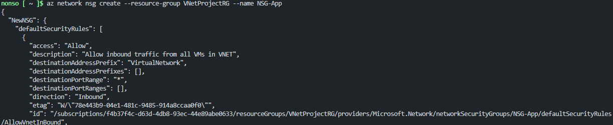

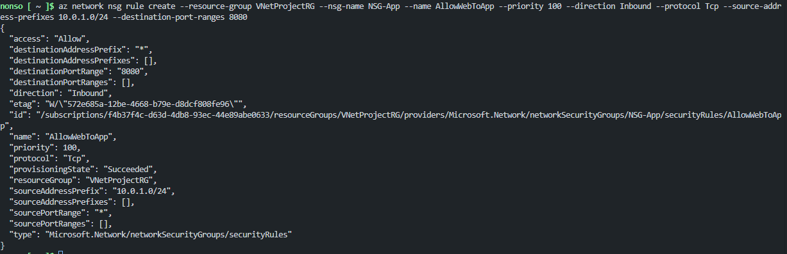

### NSG for DBSubnet (Allow from AppSubnetonly)
Allows traffic only from AppSubnet (port 1433), isolating the database from external sources.

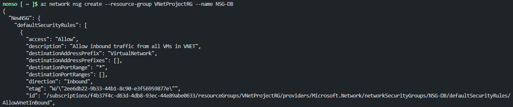

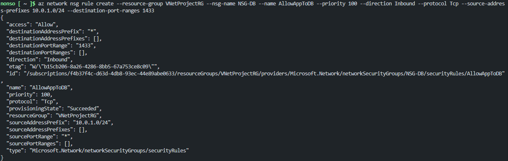

### Associate NSGs to subnet
Each NSG is now associated with the appropriate subnet to enforce the rules we've configured:

- NSG-Web → WebSubnet

- NSG-App → AppSubnet

- NSG-DB → DBSubnet

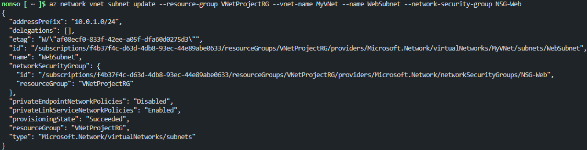

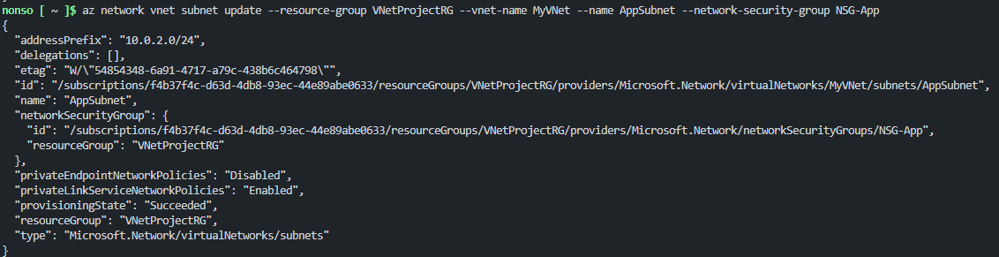

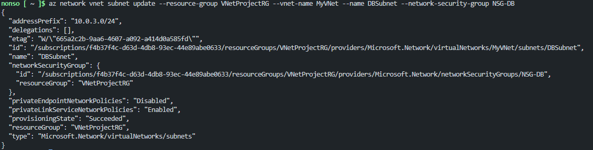

## Summary
By the end of this setup, we have:

- A well-structured virtual network

- Logical subnet segmentation

- Strict, layered security controls via NSGs

- Scalable and secure infrastructure ready for VMs or services

This architecture lays the groundwork for deploying secure, tiered cloud applications in Azure.

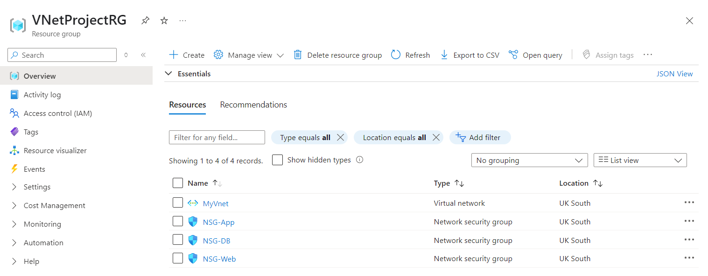
