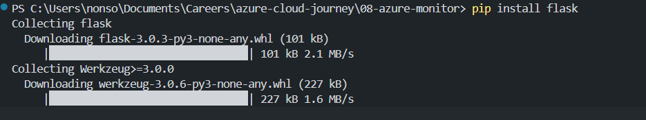

# Project 08 - Set Up Azure Monitor & Alerts


This project demonstrates a full DevOps workflow for deploying a Python Flask app to Azure App Service and enabling observability using **Application Insights**, **Log Analytics**, and **Azure Dashboard** — all while keeping it within the free tier.

---

## Features

- Python Flask web app with test endpoints
- Deployed to **Azure App Service (Linux Free Tier)**
- Monitoring and logging using **Azure Application Insights**
- Live, zero-cost observability via **Azure Dashboard**
- Custom error simulation routes (`/error`, `/random`)
- Zip-based deployment to avoid Git build issues

---

## Technologies Used

- Python 3.9 + Flask
- Azure CLI
- Azure App Service (Linux)
- Azure Application Insights
- Azure Dashboards
- Log Analytics + Kusto queries
- PowerShell

---

## Local Setup

1. Clone this repo
2. Create a virtual environment:
   ```bash
   python -m venv venv
   venv\Scripts\activate  # or source venv/bin/activate
3. Install Flask:


4. Run locally:


---

## Create Azure Resources


---

## Prepare and Deploy

```
pip freeze > requirements.txt
Compress-Archive -Path app.py,requirements.txt -DestinationPath app.zip

az webapp deployment source config-zip \
  --resource-group devops-demo-rg \
  --name flask-observe-demo \
  --src app.zip
```

---

## Create Application Insights


## Link to Web App


## Create Azure Dashboard

1. Go to Azure Portal > Dashboards
2. Create a new dashboard called "Flask Observability Dashboard"

## Simulated Endpoints for Testing

| Route     | Purpose                     |
| --------- | --------------------------- |
| `/`       | Home, returns 200           |
| `/health` | Health check endpoint (200) |
| `/error`  | Simulates a 500 error       |
| `/random` | Randomly returns 200 or 500 |
